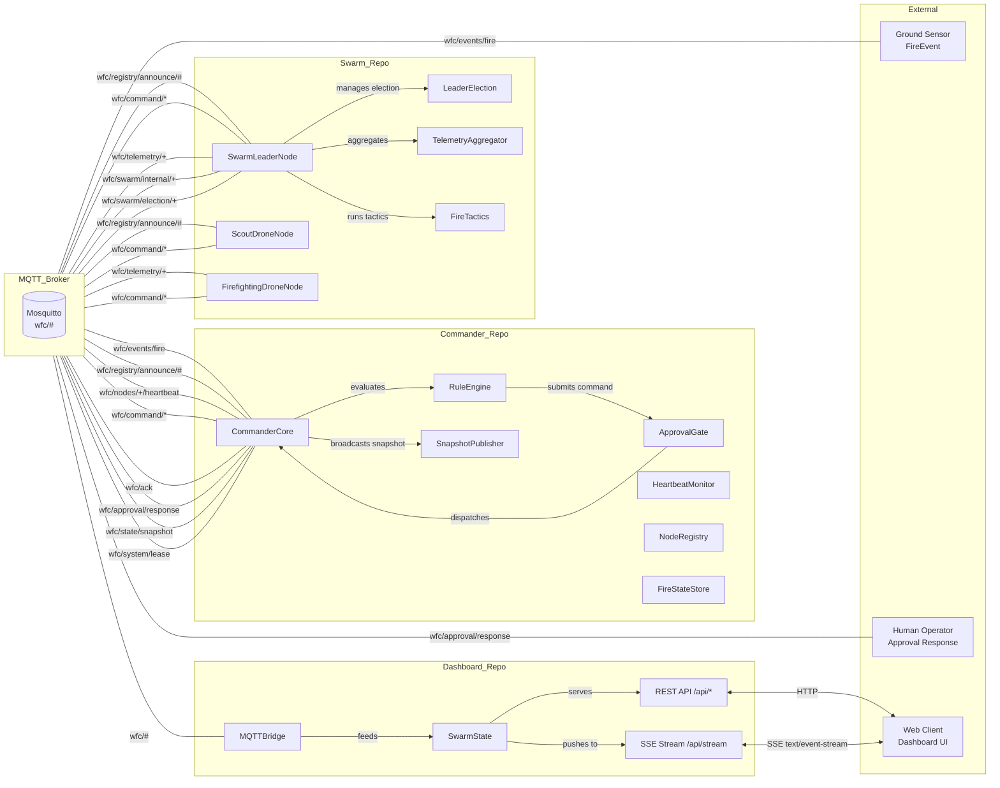

# WFC System Architecture

## Participant Reference

| Participant | Description | Repo | Key MQTT Topics |
|---|---|---|---|
| **CommanderCore** | Central orchestrator; runs rules, approves, dispatches | Commander_Repo | `wfc/events/fire`, `wfc/command/*`, `wfc/approval/response`, `wfc/state/snapshot` |
| **RuleEngine** | Evaluates fire events against rules | Commander_Repo | (internal) |
| **ApprovalGate** | Gates high-risk commands; routes operator responses | Commander_Repo | `wfc/approval/pending`, `wfc/approval/response` |
| **HeartbeatMonitor** | Tracks node heartbeats; fires on_node_failed callbacks | Commander_Repo | `wfc/nodes/+/heartbeat` |
| **NodeRegistry** | Tracks available nodes and capabilities | Commander_Repo | `wfc/registry/announce/#` |
| **SwarmLeaderNode** | Tactical commander; manages drones in a zone | Swarm_Repo | `wfc/command/{id}`, `wfc/swarm/status/{id}`, `wfc/telemetry/+` |
| **LeaderElection** | Bully protocol; detects leader death, elects replacement | Swarm_Repo | `wfc/swarm/internal/+`, `wfc/swarm/election/{zone}` |
| **TelemetryAggregator** | Ingests drone telemetry, computes swarm snapshot | Swarm_Repo | (internal) |
| **FireTactics** | Assigns drones to tasks (scout, suppress, etc.) | Swarm_Repo | (internal) |
| **ScoutDroneNode** | Scout drone; surveys fire, reports telemetry | Swarm_Repo | `wfc/telemetry/{id}` |
| **FirefightingDroneNode** | Firefighting drone; suppresses fire, reports telemetry | Swarm_Repo | `wfc/telemetry/{id}` |
| **MQTTBridge** | Listens to all wfc/#, feeds SwarmState | Dashboard_Repo | `wfc/#` |
| **SwarmState** | In-memory state machine; nodes/fires/events/approvals | Dashboard_Repo | (internal) |
| **Mosquitto** | MQTT message broker | Infrastructure_Repo | All topics |

See individual flow diagrams for detailed sequences:
- [01-node-lifecycle.md](01-node-lifecycle.md) — Node startup, heartbeat, LWT crash detection
- [02-fire-dispatch.md](02-fire-dispatch.md) — FireEvent to drone dispatch
- [03-telemetry-pipeline.md](03-telemetry-pipeline.md) — Drone telemetry to Dashboard
- [04-leader-election.md](04-leader-election.md) — Bully protocol failover
- [05-approval-gate.md](05-approval-gate.md) — High-risk command gate
- [06-commander-lease.md](06-commander-lease.md) — Commander startup, lease, state sync, failover
- [07-dashboard-streaming.md](07-dashboard-streaming.md) — Dashboard SSE and REST API
- [08-scenario-flows.md](08-scenario-flows.md) — Test scenario coverage map
