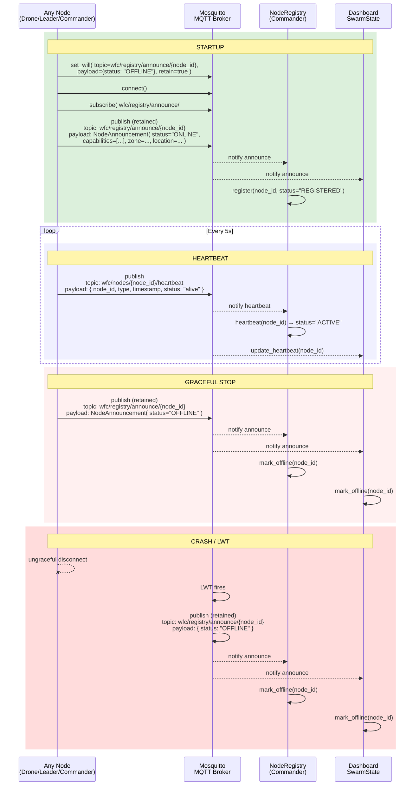

# Node Lifecycle

Covers: startup, announce, heartbeat, graceful stop, LWT crash detection.

Referenced by: [02-fire-dispatch](02-fire-dispatch.md), [03-telemetry-pipeline](03-telemetry-pipeline.md), [04-leader-election](04-leader-election.md)

## Timeline

| Phase | What happens | Key MQTT Topic | Key Message |
|---|---|---|---|
| Startup | Set LWT, connect, announce ONLINE | `wfc/registry/announce/{id}` | `{status: "ONLINE", capabilities: [...], zone: ..., location: ...}` |
| Heartbeat | Periodic keepalive (5s) | `wfc/nodes/{id}/heartbeat` | `{status: "alive", timestamp: ...}` |
| ACTIVE promotion | After first heartbeat | (internal NodeRegistry) | `register()` → `REGISTERED`, `heartbeat()` → `ACTIVE` |
| Graceful stop | Manual shutdown | `wfc/registry/announce/{id}` | `{status: "OFFLINE"}` (retained) |
| LWT | Broker publishes on ungraceful disconnect | `wfc/registry/announce/{id}` | `{status: "OFFLINE"}` (retained, set at connect) |

## Related File Paths

| File | Role |
|---|---|
| `Swarm_Repo/core/node/field_node.py` | Base node class: `start()`, `_announce()`, `_send_heartbeat()`, `stop()` |
| `Swarm_Repo/core/node/base_node.py` | `BaseNode` with MQTT lifecycle, heartbeat, LWT setup |
| `Swarm_Repo/core/node/heartbeat.py` | `Heartbeat` timer (interval=5s) |
| `Commander_Repo/core/node_registry/registry.py` | `register()` → REGISTERED, `heartbeat()` → ACTIVE |
| `Dashboard_Repo/dashboard/state.py` | `apply_announcement()`, `mark_offline()` |

## See also

- [00-system-architecture.md](00-system-architecture.md) — Component reference
- [02-fire-dispatch.md](02-fire-dispatch.md) — Uses node lifecycle for drone readiness
- [04-leader-election.md](04-leader-election.md) — Depends on heartbeat timeout detection
