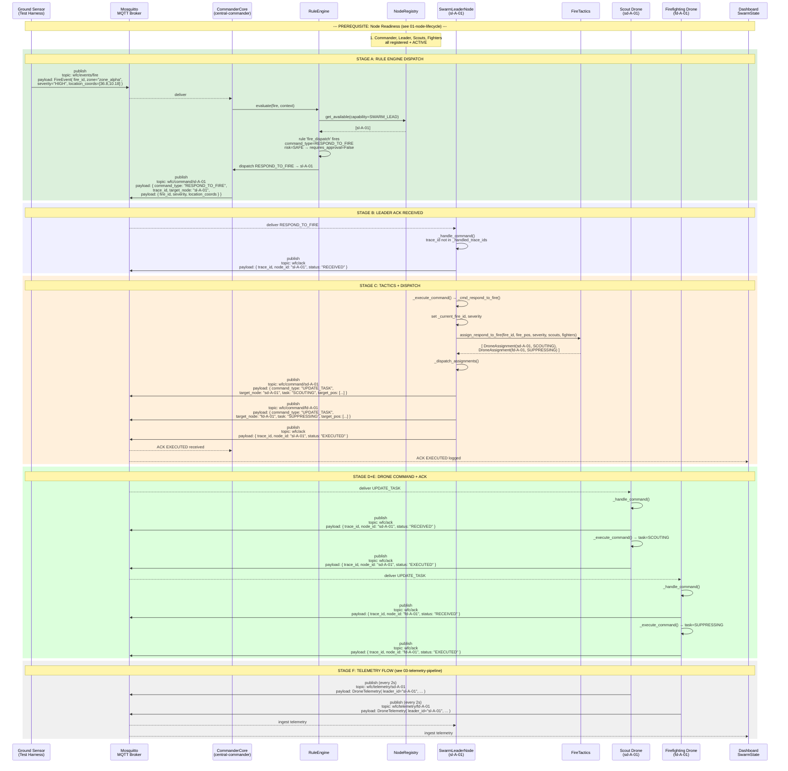

# Fire Dispatch (G-05)

Covers: FireEvent → Commander RuleEngine → Swarm Leader → Drone assignment + ACK protocol.

References: [01-node-lifecycle](01-node-lifecycle.md) for node readiness; [03-telemetry-pipeline](03-telemetry-pipeline.md) for post-dispatch telemetry; [05-approval-gate](05-approval-gate.md) for high-risk variants.



## Command Risk & Approval Gate

| Command Type | Risk Level | Requires Approval | Behavior |
|---|---|---|---|
| `RESPOND_TO_FIRE` | SAFE | No | Auto-dispatched (shown above) |
| `CONTAIN_FIRE` | SAFE | No | Auto-dispatched |
| `STAND_DOWN` | SAFE | No | Auto-dispatched |
| `REINFORCE_FIRE` | SAFE | No | Auto-dispatched |
| `PREEMPT_RESOURCE` | DISRUPTIVE | Yes | [See approval-gate](05-approval-gate.md) |
| `ESCALATE_FIRE` | IRREVERSIBLE | Yes | [See approval-gate](05-approval-gate.md) |
| `ABORT_MISSION` | IRREVERSIBLE | Yes | [See approval-gate](05-approval-gate.md) |
| `OVERRIDE_SAFETY` | IRREVERSIBLE | Yes | [See approval-gate](05-approval-gate.md) |

## ACK Protocol (FieldNode base class)

```
_handle_command(payload)
  1. Dedup check (trace_id in _handled_trace_ids → re-ACK EXECUTED, return)
  2. send_ack(RECEIVED)
  3. Validate command_type
  4. _execute_command(command_type, fire_payload, trace_id)  ← subclass implements
  5. _handled_trace_ids.add(trace_id)
  6. send_ack(EXECUTED)
```

## Key File Paths

| File | Role |
|---|---|
| `Commander_Repo/command_nodes/core_commander/commander_core.py:779` | `_handle_fire_event()` → rule evaluation → dispatch |
| `Commander_Repo/core/rule_engine/engine.py` | `evaluate()`, risk lookup |
| `Swarm_Repo/core/node/field_node.py:136` | `_handle_command()` — base ACK protocol |
| `Swarm_Repo/core/node/swarm_leader_node.py:248` | `_execute_command()` → dispatches to `_cmd_respond_to_fire()` |
| `Swarm_Repo/core/node/swarm_leader_node.py:292` | `_cmd_respond_to_fire()` → tactics → dispatch |
| `Swarm_Repo/core/tactics/fire_tactics.py:58` | `assign_respond_to_fire()` |
| `Swarm_Repo/core/node/swarm_leader_node.py:346` | `_dispatch_assignments()` → per-drone UPDATE_TASK |

## See also

- [01-node-lifecycle.md](01-node-lifecycle.md) — Prerequisite: all nodes must be ACTIVE
- [03-telemetry-pipeline.md](03-telemetry-pipeline.md) — Post-dispatch telemetry flow
- [05-approval-gate.md](05-approval-gate.md) — High-risk command variant
