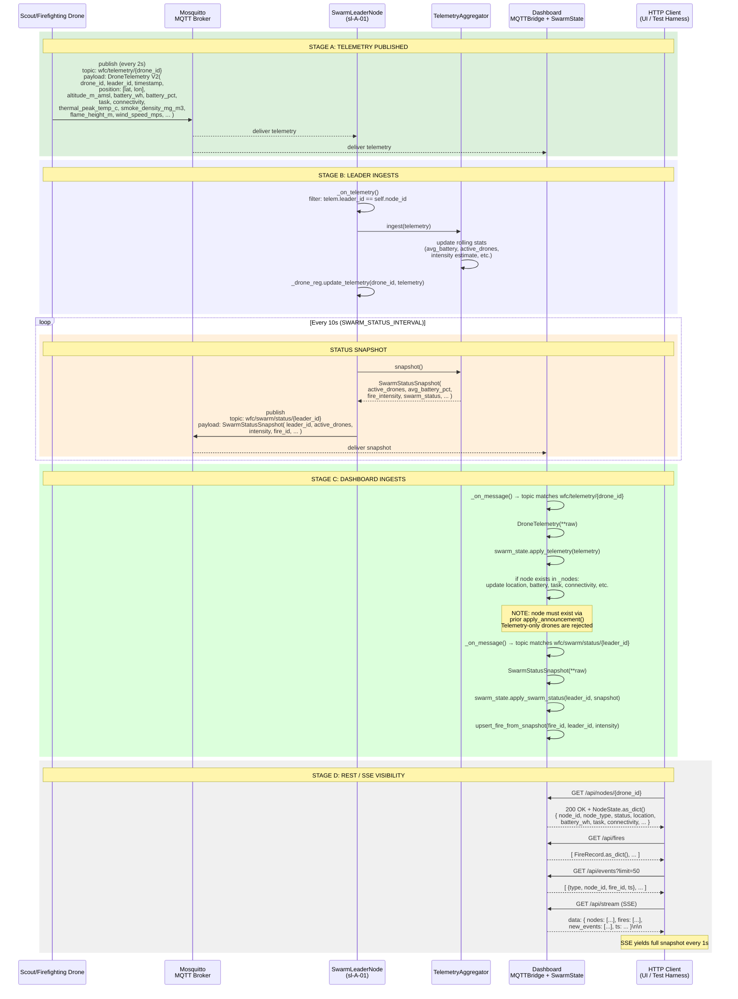

# Telemetry Pipeline (G-04, G-06, G-09)

Covers: Drone telemetry publish → Leader aggregation → Dashboard ingestion + REST/SSE visibility.

References: [01-node-lifecycle](01-node-lifecycle.md) for node readiness; [02-fire-dispatch](02-fire-dispatch.md) for how drones become active.



## SwarmState Ingestion Map

| Incoming MQTT Topic | SwarmState Method | Creates Node? |
|---|---|---|
| `wfc/registry/announce/{id}` | `apply_announcement()` | Yes — creates NodeState |
| `wfc/telemetry/{id}` | `apply_telemetry()` | No — silently dropped if node doesn't exist |
| `wfc/swarm/status/{id}` | `apply_swarm_status()` | No — silently dropped if node doesn't exist |
| `wfc/events/fire` | `apply_fire_event()` | Yes — creates FireRecord |
| `wfc/state/snapshot` | `apply_commander_snapshot()` | Yes — creates NodeState for commander |
| `wfc/approval/pending` | `add_pending_approval()` | No |

## Key Design Constraint

**Telemetry-only nodes are invisible to the Dashboard.** A `NodeState` entry is created only by `NodeAnnouncement` (topic `wfc/registry/announce/{id}`). Drone telemetry on `wfc/telemetry/{id}` without a prior announcement is silently dropped. This means test harnesses must publish a retained `NodeAnnouncement` BEFORE publishing synthetic telemetry.

## SwarmStatusSnapshot Payload

```json
{
  "leader_id": "sl-A-01",
  "active_drones": 3,
  "lost_drones": 0,
  "avg_battery_pct": 0.82,
  "min_battery_wh": 420.0,
  "avg_payload_litres": 5.0,
  "total_litres_delivered": 120.0,
  "fire_id": "abc123",
  "fire_intensity": "HIGH",
  "swarm_status": "ACTIVE",
  "suppression_pct": 35.0,
  "spread_rate": "MODERATE",
  "perimeter_estimate": 250.0,
  "wind_speed_mps_snap": 4.0,
  "wind_direction_deg_snap": 200.0
}
```

## Key File Paths

| File | Role |
|---|---|
| `Swarm_Repo/core/node/swarm_leader_node.py:378` | `_on_telemetry()` — leader ingests drone telemetry |
| `Swarm_Repo/core/aggregator/telemetry_aggregator.py` | `ingest()`, `snapshot()`, rolling stats |
| `Dashboard_Repo/dashboard/mqtt_bridge.py` | MQTT subscriptions, message routing to SwarmState |
| `Dashboard_Repo/dashboard/state.py:247` | `apply_announcement()` — creates NodeState |
| `Dashboard_Repo/dashboard/state.py:255` | `apply_telemetry()` — rejects unannounced drones |
| `Dashboard_Repo/dashboard/state.py:262` | `apply_swarm_status()` — stores leader snapshot |
| `Dashboard_Repo/dashboard/server.py` | REST endpoints + SSE stream |

## See also

- [01-node-lifecycle.md](01-node-lifecycle.md) — Nodes must be announced before telemetry is accepted
- [07-dashboard-streaming.md](07-dashboard-streaming.md) — SSE stream details
- [02-fire-dispatch.md](02-fire-dispatch.md) — How drones become active and start telemetry
