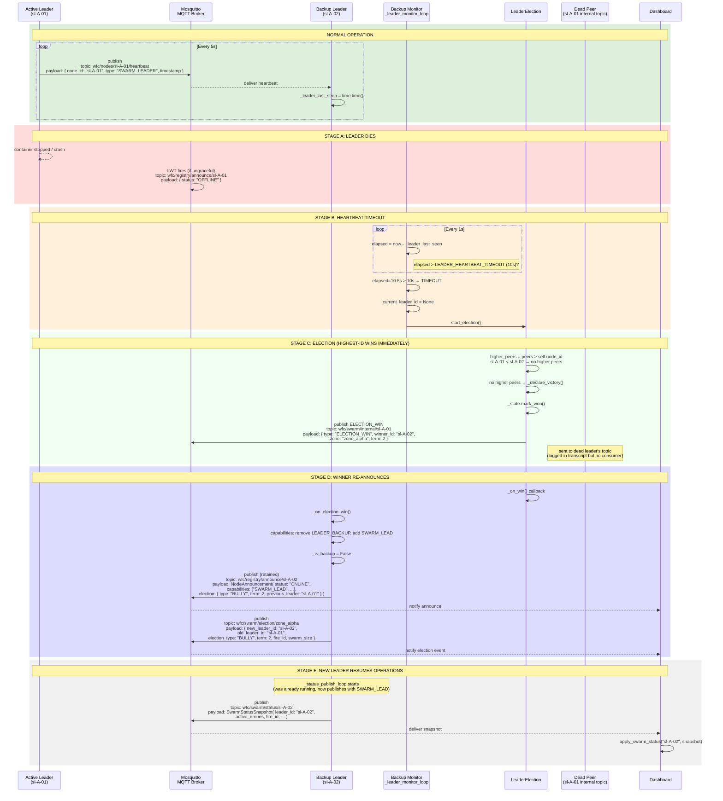

# Leader Election (G-07, G-08) — Bully Protocol Failover

Covers: active leader failure → backup heartbeat timeout → bully election → new leader promoted.

References: [01-node-lifecycle](01-node-lifecycle.md) for heartbeat/LWT; [06-commander-lease](06-commander-lease.md) for comparison with commander-level failover.



## Bully Protocol Variant: sl-A-01 (lower ID) detects leader death

If the lower-ID node (sl-A-01) were the backup and sl-A-02 the active leader died:

```
sl-A-01._leader_monitor_loop detects timeout
  → LE.start_election()
  → higher_peers = [sl-A-02] (higher ID ❯ "sl-A-01" < "sl-A-02")
  → Send ELECTION_START to wfc/swarm/internal/sl-A-02
  → Wait ELECTION_TIMEOUT (5s)
  → If no ELECTION_OK received → _declare_victory()
```

In our current setup, sl-A-02 has the higher ID, so it skips directly to victory (no ELECTION_START is ever published).

## Configuration

| Env Var | Default | Purpose |
|---|---|---|
| `LEADER_HEARTBEAT_TIMEOUT` | `10` | Seconds without a leader heartbeat before triggering election |
| `ELECTION_TIMEOUT` | `5` | Seconds to wait for ELECTION_OK from higher peers |
| `SWARM_STATUS_INTERVAL` | `10` | Seconds between SwarmStatusSnapshot publishes |
| `IS_BACKUP` | `false` | If `"true"`, node starts in backup mode (no SWARM_LEAD cap) |
| `BACKUP_PEERS` | `""` | Comma-separated peer IDs (e.g. `"sl-A-01"`) |

## Key File Paths

| File | Role |
|---|---|
| `Swarm_Repo/core/node/swarm_leader_node.py:484` | `_leader_monitor_loop()` — 1s check for heartbeat timeout |
| `Swarm_Repo/core/election/leader_election.py:62` | `start_election()` — bully protocol entry |
| `Swarm_Repo/core/election/leader_election.py:168` | `_declare_victory()` — publishes ELECTION_WIN + triggers _on_win |
| `Swarm_Repo/core/node/swarm_leader_node.py:506` | `_on_election_win()` — re-announces with SWARM_LEAD |
| `Swarm_Repo/core/election/leader_election.py:204` | `_send()` — publishes to `wfc/swarm/internal/{target}` |

## See also

- [01-node-lifecycle.md](01-node-lifecycle.md) — Heartbeat mechanism, LWT, OFFLINE detection
- [06-commander-lease.md](06-commander-lease.md) — Commander-level failover (different mechanism using lease)
