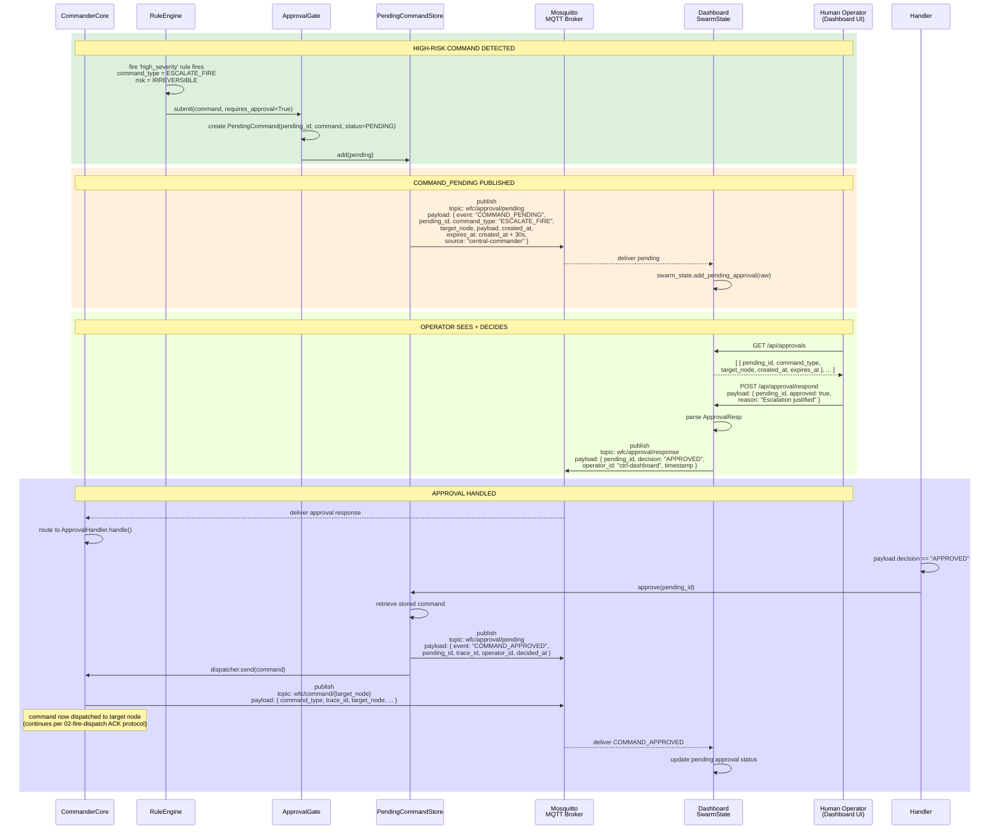
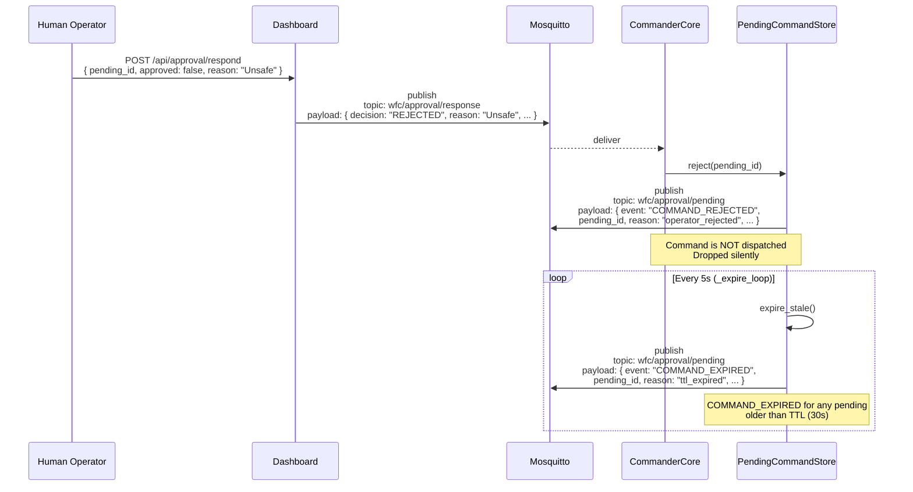

# Approval Gate (G-10)

Covers: High-risk command detection → Pending approval published → Operator response → Dispatch or reject.

References: [02-fire-dispatch](02-fire-dispatch.md) for how SAFE commands bypass this flow.



## Rejected / Expired Path



## Risk Levels & Command Routing

```mermaid
flowchart LR
  subgraph RuleEngine
    A[Rule triggers]
    B{risk?}
  end
  A --> B
  B -->|SAFE| C[Auto-dispatch<br/>via dispatcher.send()]
  B -->|DISRUPTIVE| D[ApprovalGate<br/>requires approval]
  B -->|IRREVERSIBLE| D
  D --> E{PendingStore}
  E -->|approved| C
  E -->|rejected| F[Write event log<br/>No dispatch]
  E -->|expired| F
```

## Key Payloads

| Event | Topic | Key Fields |
|---|---|---|
| `COMMAND_PENDING` | `wfc/approval/pending` | `pending_id`, `command_type`, `target_node`, `created_at`, `expires_at` |
| `COMMAND_APPROVED` | `wfc/approval/pending` | `pending_id`, `trace_id`, `operator_id`, `decided_at` |
| `COMMAND_REJECTED` | `wfc/approval/pending` | `pending_id`, `reason`, `operator_id`, `decided_at` |
| `COMMAND_EXPIRED` | `wfc/approval/pending` | `pending_id`, `reason: "ttl_expired"`, `decided_at` |
| Operator decision | `wfc/approval/response` | `pending_id`, `decision`: `"APPROVED"` / `"REJECTED"`, `operator_id`, `reason` |

## Key File Paths

| File | Role |
|---|---|
| `Commander_Repo/core/approval/approval_gate.py` | `submit()` — routes to dispatcher or PendingStore |
| `Commander_Repo/core/approval/pending_store.py` | `add()`, `approve()`, `reject()`, `expire_stale()` |
| `Commander_Repo/core/approval/approval_handler.py` | `handle()` — processes APPROVAL_RESPONSE |
| `Commander_Repo/core/rule_engine/engine.py` | `evaluate()` — sets `requires_approval` |
| `Commander_Repo/command_nodes/core_commander/commander_core.py:835` | `_handle_command()` — approval gate routing |
| `wfc_shared/wfc_shared/enums/command_risk.py` | `COMMAND_RISK` dict |
| `Dashboard_Repo/dashboard/server.py` | `GET /api/approvals`, `POST /api/approval/respond` |

## See also

- [02-fire-dispatch.md](02-fire-dispatch.md) — How SAFE commands (RESPOND_TO_FIRE) bypass approval
- [07-dashboard-streaming.md](07-dashboard-streaming.md) — How dashboard serves approval state via SSE
