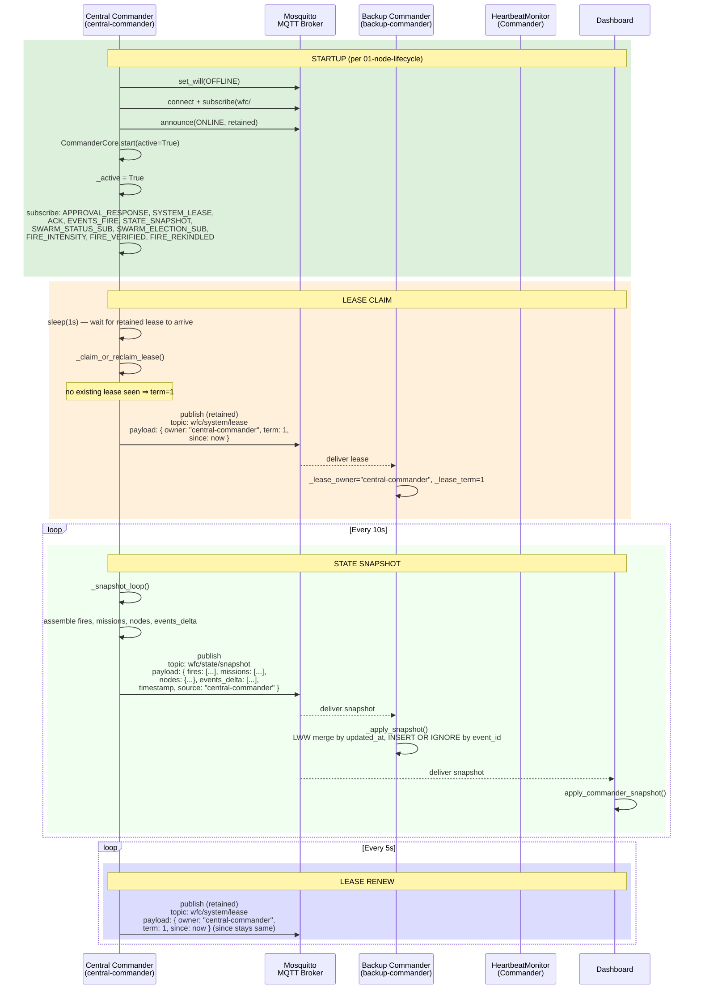
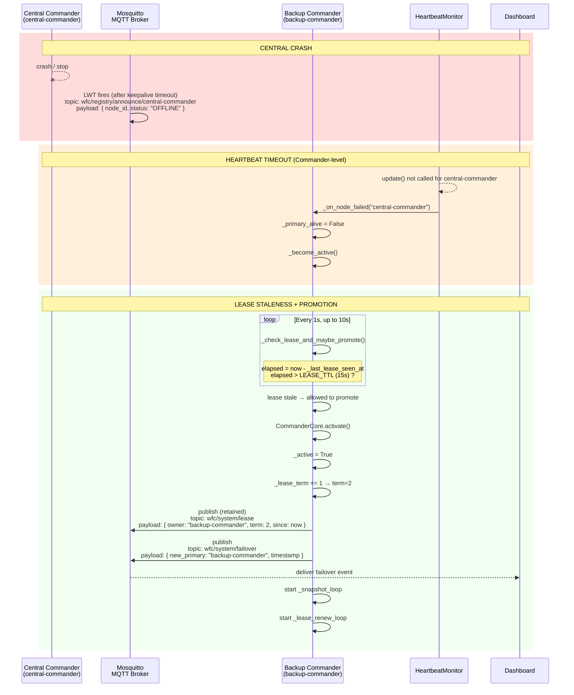
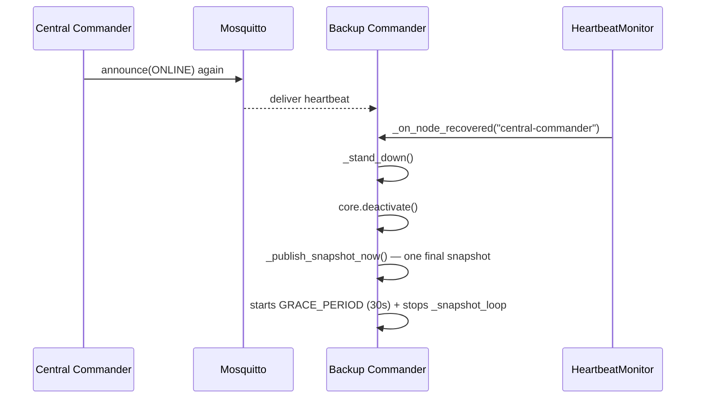

# Commander Lease & State Sync

Covers: Central Commander startup, lease acquisition, state snapshot broadcasting, backup promotion.

References: [01-node-lifecycle](01-node-lifecycle.md) for base node startup; [04-leader-election](04-leader-election.md) for contrast with swarm leader failover.

## Backup Promotion (Failover)

## Stand-down (Central Recovers)

## Lease vs. Heartbeat Comparison

| Property | Commander Lease | Swarm Leader Heartbeat |
|---|---|---|
| **Mechanism** | Retained MQTT message + periodic renew | MQTT heartbeat event (every 5s) |
| **Timeout** | 15s (LEASE_TTL) | 10s (LEADER_HEARTBEAT_TIMEOUT) |
| **Promotion** | Increment term, publish new lease | Bully protocol election |
| **Detected by** | _check_lease_and_maybe_promote() | _leader_monitor_loop (1s poll) |
| **Scope** | System-wide (one active commander) | Per-zone (one active swarm leader) |

## Key File Paths

| File | Role |
|---|---|
| `Commander_Repo/command_nodes/core_commander/commander_core.py` | `_claim_or_reclaim_lease()`, `_snapshot_loop()`, `_lease_renew_loop()`, `activate()`, `deactivate()` |
| `Commander_Repo/command_nodes/central/services/node_runtime.py` | `CentralNode` — starts CommanderCore(active=True) |
| `Commander_Repo/command_nodes/backup/services/backup_commander.py` | `BackupCommander` — `_on_node_failed()`, `_become_active()`, `_stand_down()` |
| `Commander_Repo/core/node/base_node.py` | `HeartbeatMonitor` — node failure/recovery callbacks |

## See also

- [01-node-lifecycle.md](01-node-lifecycle.md) — Base node startup, heartbeat, LWT
- [04-leader-election.md](04-leader-election.md) — Swarm leader failover (different mechanism)
