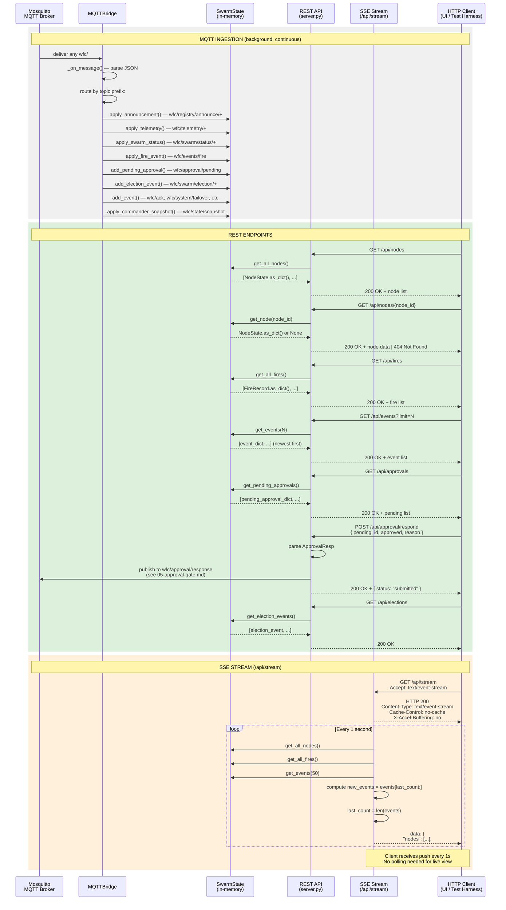

# Dashboard SSE & REST API

Covers: how the dashboard serves data via REST endpoints and Server-Sent Events streaming.

References: [03-telemetry-pipeline](03-telemetry-pipeline.md) for how SwarmState gets populated.



## REST API Endpoint Reference

| Method | Endpoint | Handler | Returns |
|---|---|---|---|
| GET | `/api/nodes` | `get_nodes()` | `list[NodeState]` |
| GET | `/api/nodes/{node_id}` | `get_node()` | `NodeState` or 404 |
| GET | `/api/fires` | `get_fires()` | `list[FireRecord]` |
| GET | `/api/events?limit=N` | `get_events()` | `list[event_dict]` |
| GET | `/api/approvals` | `get_approvals()` | `list[pending_approval]` |
| POST | `/api/approval/respond` | `approval_respond()` | `{status: "submitted"}` |
| GET | `/api/elections` | `get_elections()` | `list[election_event]` |
| GET | `/api/stream` | `sse_stream()` | SSE `text/event-stream` |

## NodeState Fields (as returned by `as_dict()`)

```json
{
  "node_id": "sl-A-01",
  "node_type": "SWARM_LEADER",
  "capabilities": ["RECEIVE_COMMANDS", "HEARTBEAT", "TELEMETRY", "SWARM_LEAD"],
  "status": "ONLINE",
  "zone": "zone_alpha",
  "location": [36.8065, 10.1815],
  "announced_at": 1234567890.0,
  "last_seen": 1234567895.0,
  "task": null,
  "connectivity": null,
  "battery_wh": null,
  "altitude_m_amsl": null,
  "battery_pct": null,
  // ... telemetry fields (set after apply_telemetry)
}
```

## SSE Stream Format

```
data: {"nodes":[...],"fires":[...],"new_events":[...],"ts":1234567890.0}\n\n
```

- Delivered every 1 second
- `nodes` is a FULL snapshot (not delta) — client replaces its local list
- `fires` is also a FULL snapshot
- `new_events` is a DELTA (events since the client's last read, capped at 50)
- Client should handle reconnection with `Last-Event-ID` support (optional)

## Key File Paths

| File | Role |
|---|---|
| `Dashboard_Repo/dashboard/server.py` | All REST endpoints + SSE stream generator |
| `Dashboard_Repo/dashboard/mqtt_bridge.py` | `_on_message()` — routes MQTT to SwarmState |
| `Dashboard_Repo/dashboard/state.py` | `SwarmState`, `NodeState`, `FireRecord`, `as_dict()` |

## See also

- [03-telemetry-pipeline.md](03-telemetry-pipeline.md) — How SwarmState gets populated from MQTT
- [05-approval-gate.md](05-approval-gate.md) — Approval REST endpoints in context
