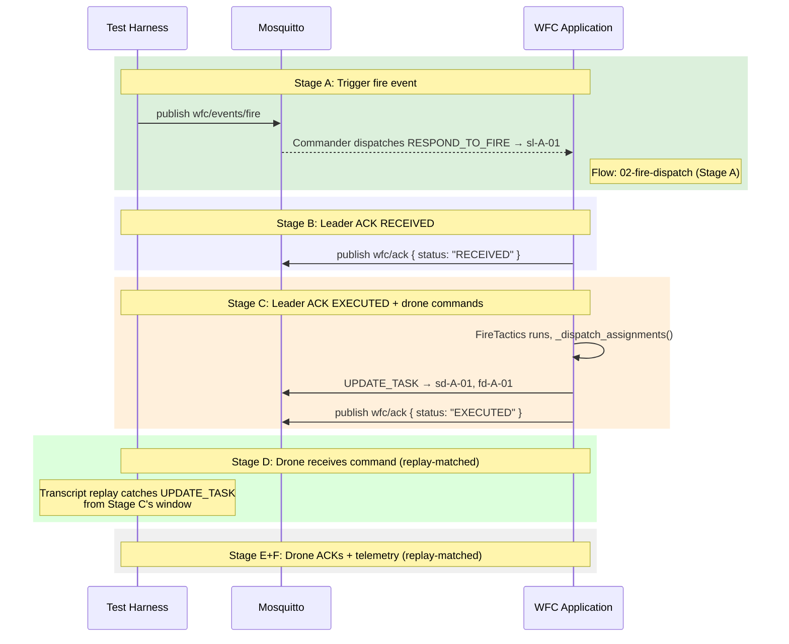
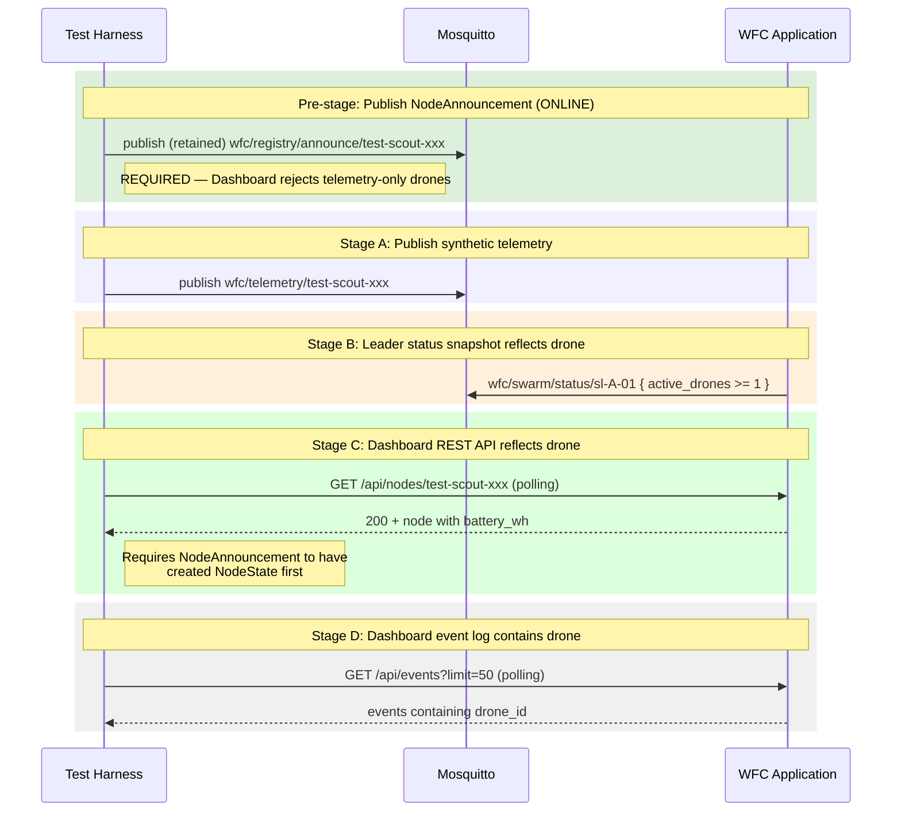
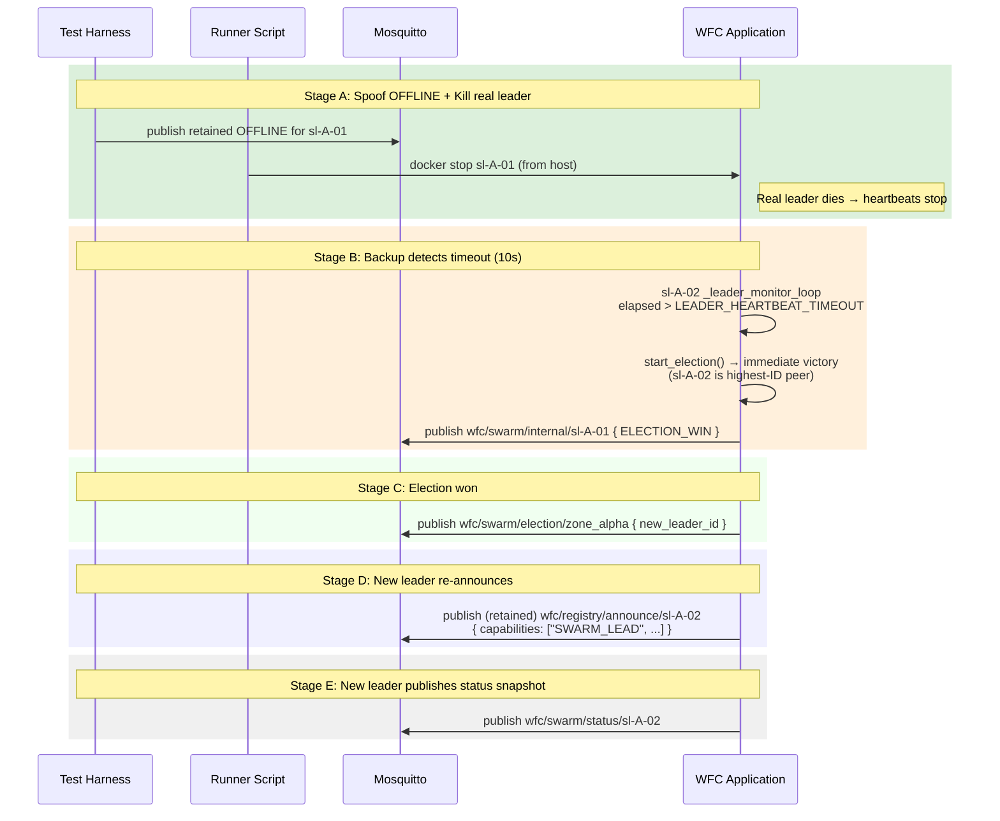
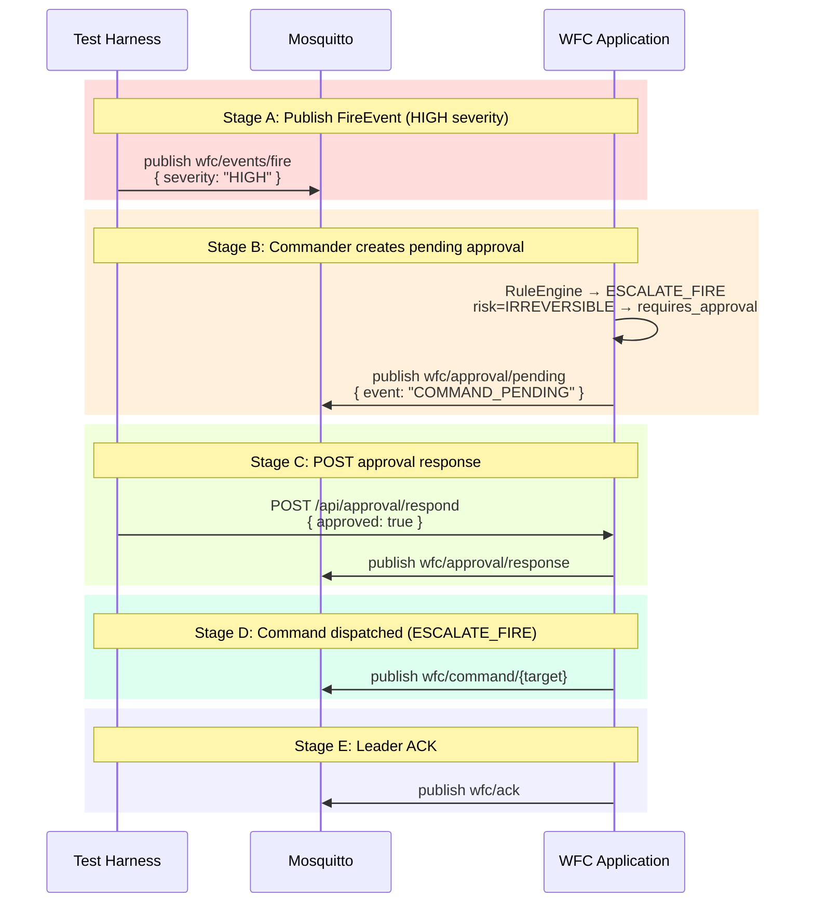
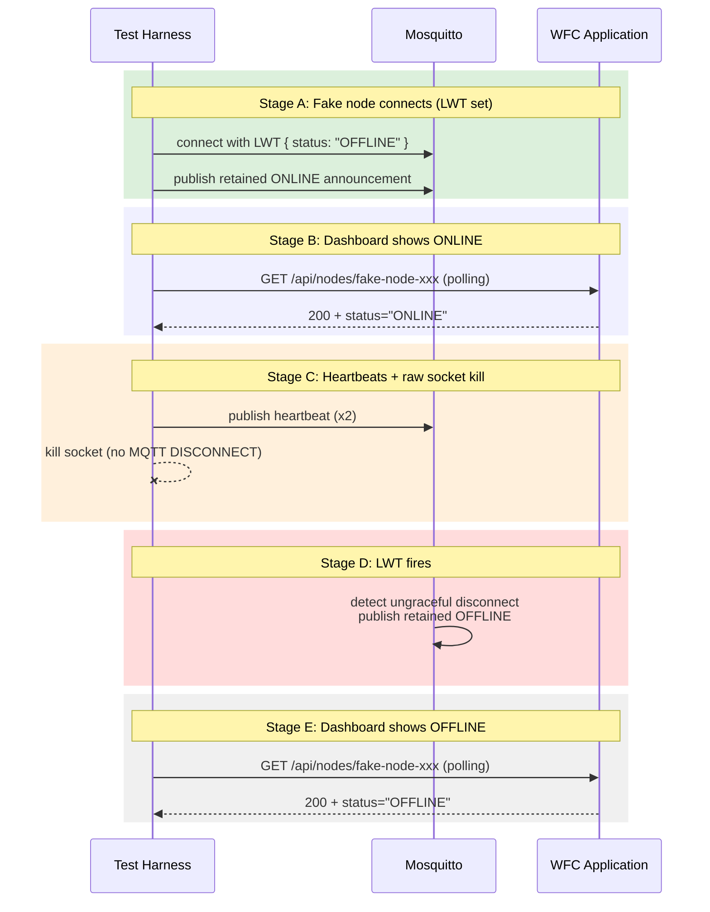

# Test Scenario Coverage Map

Covers: how the 5 automated Docker Compose orchestrator scenarios exercise the system flows, what passes, and why.

## Coverage Matrix

| Scenario | Flow Diagrams Exercised | Stages | Status |
|---|---|---|---|
| 1. Fire Dispatch | [02-fire-dispatch](02-fire-dispatch.md), [01-node-lifecycle](01-node-lifecycle.md) | A–F (6) | PASSED |
| 2. Telemetry & Dashboard | [03-telemetry-pipeline](03-telemetry-pipeline.md), [07-dashboard-streaming](07-dashboard-streaming.md) | A–D (4) | PASSED |
| 3. Leader Election | [04-leader-election](04-leader-election.md), [01-node-lifecycle](01-node-lifecycle.md) | A–E (5) | PASSED |
| 4. Approval Gate | [05-approval-gate](05-approval-gate.md) | A–E (5) | PENDING FIX |
| 5. Node Lifecycle & LWT | [01-node-lifecycle](01-node-lifecycle.md) | A–E (5) | PASSED |

## Scenario 1: Fire Dispatch

**Key insight:** Stages D/E/F pass via MQTTBus transcript replay (the drone commands arrived during Stage B/C but Stage D's listener wasn't registered yet — the [engine fix](../orchestrator/mqtt_bus.py) replays recent transcript to new listeners).

## Scenario 2: Telemetry & Dashboard

**Key fixes applied:**
1. Harness now publishes `NodeAnnouncement` (retained) before telemetry
2. Without this, `SwarmState.apply_telemetry()` silently drops unannounced drones

## Scenario 3: Leader Election

**Key insight:** sl-A-02 is the highest-ID backup (`"sl-A-02" > "sl-A-01"`), so the bully protocol skips `ELECTION_START` and goes directly to `ELECTION_WIN`. Stage B was originally looking for `ELECTION_START` — fixed to match `ELECTION_WIN`.

## Scenario 4: Approval Gate

**PENDING FIX:** The harness currently publishes `ABORT_MISSION` as a FireEvent, but `_handle_fire_event` in the commander doesn't route through the approval gate — it treats it as a fire dispatch. A HIGH-severity FireEvent should trigger `ESCALATE_FIRE` via the rule engine, which IS routed through the approval gate (risk=IRREVERSIBLE). The fix: use HIGH severity to trigger ESCALATE_FIRE instead of publishing ABORT_MISSION as a command.

## Scenario 5: Node Lifecycle & LWT

## Flows NOT Covered by Orchestrator Scenarios

| Flow | Why Not Covered | Where Tested |
|---|---|---|
| Backup Commander failover | Requires stopping central-commander mid-run + waiting for backup promotion | Unit tests + SI/E2E subprocess tests |
| PriorityRule preemption | Requires concurrent fires + resource contention | Unit tests |
| Physical engine (GPS, wind, sensors, movement) | Requires drone simulator with physics | Not yet |
| Database persistence | No DB integration in orchestrated stack | Unit tests |
| Concurrent approval expiry vs operator decision | Requires timing-dependent race condition | Manual |
| Broker restart mid-flow | Requires broker lifecycle management | Not yet |

## See also

- [00-system-architecture.md](00-system-architecture.md) — System overview
- Flow diagrams 01–07 for detailed MQTT message sequences
