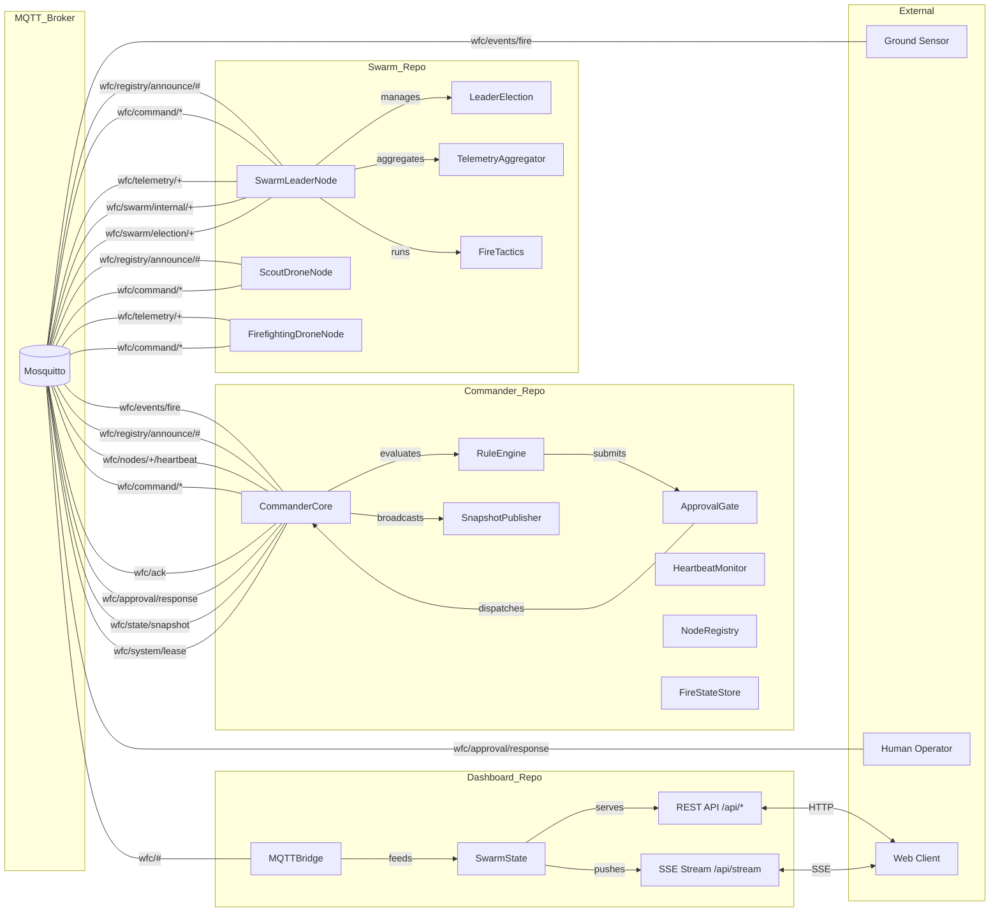

# Wildfire Command System (WFC)

Distributed multi-drone wildfire orchestration platform. Detects fires via ground sensors, dispatches drone swarms autonomously, evaluates priorities through a 15-rule engine, and streams live telemetry to a web dashboard.

## Architecture



## Repos

| Repo | Purpose | Port |
|------|---------|------|
| `wfc_shared` | Wire contracts — schemas, enums, topic constants | — |
| `Commander_Repo` | Rule engine, dispatch, approval gate, state sync | — |
| `Swarm_Repo` | Drone nodes, physics engine, telemetry, leader election | — |
| `Dashboard_Repo` | Web UI, REST API, SSE streaming, live map | 8080, 8081 |
| `Integration_Tests` | E2E test orchestrator with pipeline UI | 9090 |
| `Infrastructure_Repo` | Docker Compose, Mosquitto config | 1883, 9001 |

## Quick Start

```bash
cd Infrastructure_Repo
docker compose up --build
```

| Service | URL |
|---------|-----|
| Dashboard | http://localhost:8080 |
| Map view | http://localhost:8081 |
| Test console | http://localhost:9090 |
| MQTT broker | localhost:1883 |

## Tech Stack

- **Runtime:** Python 3.14
- **Messaging:** MQTT via Eclipse Mosquitto
- **Schemas:** Pydantic v2 (strict mode)
- **Web:** FastAPI + Uvicorn + SSE
- **Containerization:** Docker + Docker Compose
- **Type checking:** Pyright (strict)

## Project Structure

```
wfc/
  wfc_shared/          Shared wire contracts (pip-installable)
  Commander_Repo/      Central orchestration + rule engine
  Swarm_Repo/          Drone node implementations
  Dashboard_Repo/      Web dashboard + API
  Integration_Tests/   E2E test orchestrator
  Infrastructure_Repo/ Docker Compose + Mosquitto config
  Docs/                Architecture diagrams (Mermaid)
```

## License

MIT
