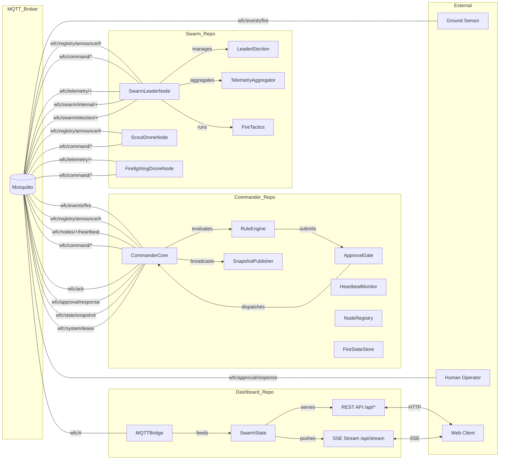

<div align="center">

# 🔥 Wildfire Command System (WFC)

**Autonomous multi-drone wildfire detection & suppression orchestration**

Detect fires from distributed ground sensors → evaluate with a 15-rule intelligence engine → autonomously dispatch drone swarms → stream live telemetry to a real-time web dashboard.

[](https://www.python.org/)
[](https://fastapi.tiangolo.com/)
[](https://mosquitto.org/)
[](https://www.docker.com/)
[](https://github.com/Zied-Jmal/wfc/actions)
[](https://opensource.org/licenses/MIT)

</div>

---

## ✨ What Is WFC?

WFC is a **distributed, autonomous wildfire command platform**. When a ground sensor detects heat, the system doesn't wait for a human to notice — it automatically:

1. **Ingests** the fire event from a network of distributed ground sensors
2. **Evaluates** severity and priority using a configurable 15-rule intelligence engine
3. **Gates** high-risk commands through an operator approval flow
4. **Dispatches** drone swarms — scout drones to survey, firefighting drones to suppress
5. **Coordinates** the swarm with a self-healing leader election (bully protocol)
6. **Streams** live telemetry to a real-time web dashboard with a live map

It's a self-contained, fully containerized take on autonomous emergency response: **sensor → intelligence → action → situational awareness**, end to end.

---

## 🎯 Key Features

- 🛰️ **Distributed detection** — Fires reported from networked ground sensors over MQTT
- 🧠 **15-rule intelligence engine** — Prioritizes fires, tracks spread, containment, rekindles, resource exhaustion, and more
- 🔐 **Approval gate** — High-risk commands require operator sign-off before execution
- 🚁 **Multi-role drone swarm** — Scout, firefighting, and swarm-leader nodes, each with a full physics engine
- 👑 **Self-healing leadership** — Bully-protocol leader election with automatic failover
- 📊 **Real-time dashboard** — REST API + SSE streaming to a live map of nodes, fires, and missions
- 🌐 **Event-driven messaging** — Clean MQTT topic hierarchy (`wfc/#`) across all components
- 💠 **Shared wire contracts** — One pip-installable source of truth for schemas, enums, and topics
- 🐳 **Fully containerized** — One-command `docker compose up` for the entire stack
- 🧪 **Layered test suite** — Unit → component → repo-integration → system-integration → E2E

---

## 🧭 How It Works

A single fire event flows through the system like this:

```
Ground Sensor
   │  publishes wfc/events/fire
   ▼
Commander (Rule Engine)
   │  evaluates 15 rules → assigns priority
   │  if high-risk → Approval Gate (operator)
   ▼
Commander (Dispatcher)
   │  publishes wfc/command/* dispatch
   ▼
Swarm Leader
   │  delegates to drones
   ▼
Scout / Firefighting Drones
   │  survey & suppress, publish telemetry
   ▼
Dashboard
   │  aggregates, streams via SSE
   ▼
Human Operator (live map & approvals)
```

Commanders run in **primary/backup** pairs for high availability, nodes self-register via heartbeats, and leaders are re-elected automatically if lost.

---

## 🏗 Architecture



---

## 🧩 System Components

| Repo | Role |
|------|------|
| [`wfc_shared`](wfc_shared/) | Single source of truth for wire contracts — schemas, enums, MQTT topic builders (pip-installable) |
| [`Commander_Repo`](Commander_Repo/) | Central orchestration — 15-rule engine, approval gate, dispatch, heartbeat monitor, state sync |
| [`Swarm_Repo`](Swarm_Repo/) | Drone nodes — scout / firefighting / swarm leader, physics engine, telemetry, leader election |
| [`Dashboard_Repo`](Dashboard_Repo/) | Real-time web dashboard — REST API, SSE streaming, live map |
| [`Integration_Tests`](Integration_Tests/) | End-to-end test orchestrator with live pipeline UI |
| [`Infrastructure_Repo`](Infrastructure_Repo/) | Docker Compose stack — Mosquitto broker, all services |

---

## 🚀 Quick Start

### Prerequisites

- [Docker](https://www.docker.com/products/docker-desktop/) + Docker Compose

### Run the full stack

```bash
cd Infrastructure_Repo
docker compose up --build
```

| Service | URL |
|---------|-----|
| 🖥️ Dashboard | http://localhost:8080 |
| 🗺️ Map view | http://localhost:8081 |
| 🧪 Test console | http://localhost:9090 |
| 📡 MQTT broker | `localhost:1883` (WebSockets: `9001`) |

Teardown:

```bash
docker compose down -v
```

### Run the tests

```bash
pip install -e wfc_shared
pytest tests/ -v --timeout=30
```

---

## 🚁 Drone Roles

| Drone | Role |
|-------|------|
| **Scout** | Surveys the fire, reports telemetry, returns to base |
| **Firefighter** | Suppresses the fire with a water payload, refuels at base |
| **Swarm Leader** | Coordinates drones in a zone, runs fire tactics, elected via bully protocol |

---

## 🛠 Tech Stack

| Layer | Technology |
|-------|-----------|
| **Language** | Python 3.14 |
| **Messaging** | MQTT via Eclipse Mosquitto |
| **Schemas** | Pydantic v2 (strict mode) |
| **Web** | FastAPI + Uvicorn + SSE |
| **Persistence** | SQLite |
| **Containerization** | Docker + Docker Compose |
| **Type checking** | Pyright (strict) |
| **Linting** | Ruff + pre-commit |

---

## 📡 API Overview

The dashboard exposes a REST API plus an SSE stream:

| Method | Path | Description |
|--------|------|-------------|
| `GET` | `/api/broker/status` | MQTT broker connection status |
| `GET` | `/api/nodes` | All registered nodes |
| `GET` | `/api/nodes/{id}` | Single node detail |
| `GET` | `/api/fires` | All active fires |
| `GET` | `/api/missions` | All missions |
| `GET` | `/api/approvals` | Pending approvals |
| `POST` | `/api/approval/{id}/respond` | Approve / reject a command |
| `GET` | `/api/stream` | SSE event stream (realtime) |

---

## 📁 Project Structure

```
wfc/
├── wfc_shared/          # Shared wire contracts (pip-installable)
├── Commander_Repo/      # Central orchestration + 15-rule engine
├── Swarm_Repo/          # Drone node implementations + physics engine
├── Dashboard_Repo/      # Web dashboard + REST API + SSE
├── Integration_Tests/   # E2E test orchestrator with pipeline UI
├── Infrastructure_Repo/ # Docker Compose + Mosquitto config
├── Docs/                # Architecture diagrams + test protocols
└── tests/               # Cross-repo system-integration & E2E tests
```

---

## 🧪 Testing

WFC uses a **layered** testing strategy:

| Layer | Scope |
|-------|-------|
| **Unit** | Individual rules, approval logic, registry, tactics |
| **Component** | Interactive within a single sub-system |
| **Repo-integration** | Requires Docker / broker |
| **System-integration** | All services together |
| **End-to-end** | Full scenario orchestration via the pipeline UI |

Test scenarios cover fire detection & dispatch, multi-zone response, telemetry integrity, the approval gate, and leader-election failover.

---

## 🤝 Contributing

1. Fork the repository
2. Create a feature branch (`git checkout -b feature/your-feature`)
3. Run linting & type checks (`ruff check .` and `pyright`)
4. Add tests for your change
5. Open a pull request

---

## 📄 License

[MIT](LICENSE) © zied jmal
